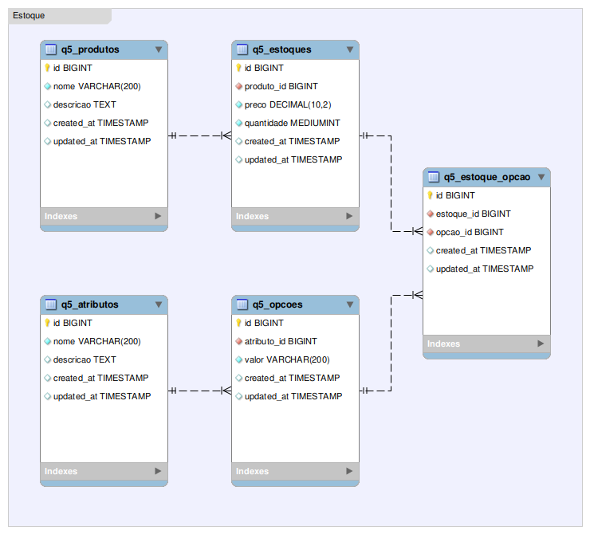

# Teste de seleção para desenvolvedor PHP - CPlug

Este teste foi realizado com o intuito de demonstrar conhecimento técnico necessário para concorrer à vaga de desenvolvedor backend PHP e Laravel na CPlug. Os requisitos podem ser visto no [Arquivo de requisitos](INSTRUCOES.md) (README original do projeto).

Este documento apresenta detalhes da instalação do ambiente e considerações a respeito de cada uma das respostas.

## Instalação

Para instalar, devem-se seguir os passos abaixo:

### 1. Clonar o repositório

```bash
git clone https://github.com/leandrowferreira/challenge_cplug.git
```

### 2. Instalar as dependências necessárias

```bash
composer install
cp .env.example .env
php artisan migrate
php artisan key:generate
```

## Respostas

### Questão 01 - Clientes

Para a primeira parte do exercício (refatorar o método store), foi dada especial atenção a:

  - **Concentrar o negócio da aplicação no model**: a lógica foi movida do *controller* para o *model*. O *model* manteve apenas as chamadas para o negócio e as rotinas de vallidação.
  - **Realizar testes de entrada com os dados**: antes de utilizar os dados, uma API deve verificar se todos foram passados dentro dos critérios determinados. Neste caso, os critérios estavam claros no arquivo de migração e essencialmente diziam respeito ao tamanho máximo de cada campo.
  - **Reorganizar a estrutura de dados**: a entrada da API, tal qual apresentada, funcionava, mas a estrutura do banco de dados deveria ser aprimorada, considerando que a categoria dos consumidores deve ser um *model* a parte, para que se normalize o banco. Por exemplo, se os consumidores A e B são categorizados como "ouro", apenas uma entrada "ouro" deve existir e esta categoria deve ser associada ao consumidor por um relacionamento muitos-para-muitos, perfeitamente suportado pelo Laravel.
  - **Mantida retrocompatibilidade com código legado**: a refatoração descrita no item anterior iria quebrar os testes propostos. Por esta razão, o arquivo de *model* ***Customer.php*** manteve um trecho de código legado para que o teste fosse satisfeito. Este trecho está em destaque no arquivo do *model*, em torno da linha 30.

É importante frisar que, devido à inconsistência do código original, incluindo a não-normalização do banco e a nomenclatura da tabela "customer_categories" em dissonância com o padrão do Laravel, não foi criado um *model* para tal tabela e, em consequência disso, os dados foram manipulados sem utilizar a camada *ORM* do *framework*. Por outro lado, os padrões adequados foram obedecidos na nova estrutura, que inclui as tabelas:
  - **customers**: tabela já existente na configuração original;
  - **category_customer**: tabela pivot criada para manter a relação n-n;
  - **categories**: tabela criada para servir o novo *model* ***Category***. Seguindo uma boa prática, tanto neste como no *model* ***Customer*** o nome da tabela foi explicitado na proprietade `protected table`.

A segunda parte do exercício trata de um *update* trivial e não requer maiores explicações. Ainda assim, é digno de nota que, pelo mesmo motivo já descrito, houve a necessidade de se escrever algum código para manter a estrutura legada (destacado próximo à linha 65 do *model* ***Customer***).

Foram criados mais dois testes para este exercício. Ambos residem no arquivo **CustomerAdicionaisTest.php**:
  - Um teste para verificar se a tentativa de inserir um novo registro com dados que não passem nos testes de validação será rejeitada;
  - Um teste para verificar a atualização do registro seguindo a nova estrutra (com relacionamento n-n).


### Questão 2 - Cálculo de parcelas

Esta questão não requer comentários adicionais, devido à simplicidade de seu requisito.

É bom notar, apesar disso, que foi criado um novo teste, no arquivo **PaymentAdicionaisTest.php**, que verifica outra divisão com o mesmo princípio da dízima periódica.


### Questão 3 - Consumo de API

A implementação do consumo de API a partir do backend é trivial. Mais uma vez foi implementado o código de validação. As validações são as seguintes:
  - a quantidade é um valor numérico;
  - a data de compra é válida e está no formato Y-m-d;
  - a data de venda é válida, está no formato Y-m-d e é posterior à data de compra;
  - o criptoativo (token) está na lista dos tokens permitidos (listados na questão 6)

A API pode retornar erros e seus respectivos códigos HTTP, diferentes de 200. Estes códigos são `500` em caso de erro na chamada da API ou `422` em caso de dados inválidos fornecidos na chamada. Os valores retornados no caso de uma chamada bem sucedida arredonda as saídas apenas no final, para evitar a propagação de erros.

Esta implementação feriu o princípio básico do MVC, mantendo o negócio no *controller*, mas é sabido que o objetivo do teste é ilustrar a implementação do consumo da API por parte do *backend*. Devido a este escopo, e em favor da simplicidade, foi considerada tolerável esta infração.

### Questão 4 - Verificação de intervalo disponível

Esta questão é não requer qualquer comentário adicional.


### Questão 5 - Modelagem de produtos com atributos

Esta interessante questão demonstra como um problema aparentemente simples pode se mostrar de complexidade moderada quando implementado. A tabela `estoques` mantém a parte principal da informação, armazenando os dados *preço* e *quantidade* de um determinado produto. Esta tabela possui um relacionamento n-n com a tabela `opcoes`, que indica os valores possíveis de um determinado atributo (por exemplo: branco e PP). Então, cada entrada no estoque é diferenciada a partir destes relacionamentos.

É claro que, através da tabela `opcoes`, é possível chegar à tabela `atributos`, identificando facilmente quais atributos cada produto possui (por exemplo: cor e tamanho).

Abaixo, a modelagem simplificada, para melhor entendimento:




### Questão 6 - Frontend

Para este exercício, foram utilizados *VueJS* e *Bootstrap*. Para simplificar, foi utilizada a mesma aplicação, mas desta vez respondendo através de uma rota `web`, e não `api`. Os arquivos `js` e `css` não estão compilados no diretório `public`, não requerendo instalação das dependências de frontend. Mesmmo assim, caso deseje instalá-las e, assim, habilitar a possibilidade de alteração no código, deve-se executar o seguinte comando na raiz do projeto:

```bash
npm i && npm run dev
```

Para executar o servidor de testes, o comando é o tradicional:

```bash
php artisan serve
```

O *frontend* é composto de apenas uma página, presente no endereço `http://localhost:8000/crypto`. Os requisitos solicitados no exercício foram antendidos e as devidas validações são realizadas no *frontend* antes da chamada à API desenhada na questão 3. Foram ilustrados alguns recursos do *VueJS* e do *Laravel*:
  - uso de *blades* usando templates
  - componentes aninhados trocando informações
  - implementação de componentes de terceiros (date e mask)
  - chamada remota usando o Axios, passando implicitamente o token `csrf`

Mais uma vez em benefício da simplicidade, não foi criado um *controller*, sendo a *view* invocada diretamente do arquivo de rotas. Para esta decisão, foi levado em consideração que este recurso não utiliza persistência em banco de dados, uma das principais funções do modelo MVC.

É **muito importante** frisar que a implementação desta API não segue o padrão *RESTful*, a partir de sua própria concepção (por exemplo, ela se vale de uma chamada *POST* para consulta). Os requisitos (ditados pela rotina de teste de funcionalidade) poderiam ser mais bem definidos.


## Conclusão

O teste se mostra muito assertivo e prático, permitindo-se demonstrar tanto a capacidade de programar no Framework como a qualidade do código implementado. Não requer vários dias para ser realizado e mesmo assim é capaz de medir a capacidade técnica do candidato.


## Sugestão de melhoria

Typo na seção Instruções
DB nos uses do test

## Outros


Questão 3:
    era pra ser post? É rest?
    não foi criado model por não ser do escopo da questão
    não foi verificado se o token é válido
    só arredondados na saída para evitar a propagação de erro